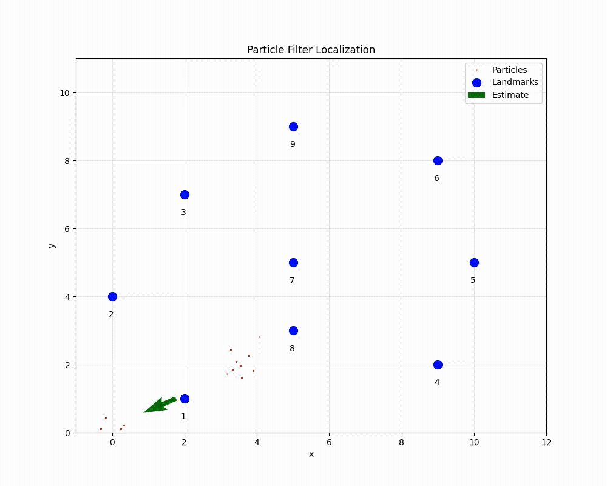

# Particle Filter Localization

A Python implementation of a Monte Carlo Localization (MCL) algorithm using particle filters for robot localization in a known map environment.

## 📋 Overview

This project implements a particle filter-based localization system that estimates a robot's pose (position and orientation) in a 2D environment with known landmark positions. The algorithm uses odometry data and range measurements to landmarks to probabilistically determine the robot's location.

### Key Features

- **Monte Carlo Localization**: Uses a particle filter approach for robust localization
- **Motion Model**: Implements odometry-based motion prediction with configurable noise parameters
- **Sensor Model**: Range-based measurement model using Gaussian likelihood
- **Resampling**: Stochastic Universal Sampling (SUS) for efficient particle resampling
- **Real-time Visualization**: Interactive matplotlib visualization showing particle distribution and estimated pose

## 🎥 Demo

<p align="center">
  
</p>

The animation demonstrates the particle filter converging from an initial uniform distribution to accurately track the robot's position as it moves through the environment. You can observe how particles (red dots) cluster around the robot's true position over time.

## 🏗️ Project Structure

```
Particle_Filter/
├── data/
│   ├── sensor_data.dat          # Odometry and sensor measurements
│   └── world.dat                 # Landmark positions
├── Results/
│   └── particle_filter_localization_simulation.gif
├── particle_filter.py            # Main particle filter implementation
├── read_data.py                  # Data loading utilities
├── particle_filter_with_video.py # Version with video recording
└── README.md
```

## 🚀 Getting Started

### Prerequisites

- Python 3.7+
- NumPy
- SciPy
- Matplotlib

### Installation

1. Clone the repository:
```bash
git clone  https://github.com/syedrafayme143/Monte-Carlo-Localization-Particle-Filter.git
cd Monte-Carlo-Localization-Particle-Filter
```

2. Install required packages:
```bash
pip install numpy scipy matplotlib
```

### Usage

Run the particle filter simulation:

```bash
python particle_filter.py
```

To generate a video recording of the simulation:

```

## 🔧 Algorithm Details

### Particle Filter Steps

The particle filter operates in four main steps at each time step:

1. **Initialization**
   - Randomly distribute particles across the map
   - Each particle represents a hypothesis of the robot's pose

2. **Motion Update (Prediction)**
   - Apply motion model based on odometry data
   - Add noise to account for motion uncertainty
   - Motion model: 
     - `x' = x + Δt × cos(θ + Δr₁)`
     - `y' = y + Δt × sin(θ + Δr₁)`
     - `θ' = θ + Δr₁ + Δr₂`

3. **Measurement Update (Correction)**
   - Compute likelihood of each particle given sensor measurements
   - Weight particles based on agreement with observed landmark ranges
   - Uses Gaussian measurement model

4. **Resampling**
   - Resample particles proportional to their weights
   - Uses Stochastic Universal Sampling for low variance
   - Prevents particle degeneracy

### Parameters

| Parameter | Default Value | Description |
|-----------|---------------|-------------|
| `num_particles` | 1000 | Number of particles in the filter |
| `sigma_r` | 0.2 | Standard deviation of range sensor noise |
| `noise` | [0.1, 0.1, 0.05, 0.05] | Motion noise parameters [α₁, α₂, α₃, α₄] |
| `map_limits` | [-1, 12, 0, 11] | Map boundaries [x_min, x_max, y_min, y_max] |

### Motion Noise Model

The motion noise is modeled as:
- `σ_r1 = α₁|Δr₁| + α₂|Δt|`
- `σ_t = α₃|Δt| + α₄(|Δr₁| + |Δr₂|)`
- `σ_r2 = α₁|Δr₂| + α₂|Δt|`

## 📊 Data Format

### World Data (`world.dat`)
```
landmark_id x_position y_position
1 5.0 10.0
2 10.0 5.0
...
```

### Sensor Data (`sensor_data.dat`)
```
ODOMETRY r1 t r2
SENSOR landmark_id range bearing
SENSOR landmark_id range bearing
...
```

## 🎨 Visualization

The real-time visualization displays:
- **Red dots**: Individual particles representing pose hypotheses
- **Blue circles**: Known landmark positions (numbered)
- **Green arrow**: Estimated robot pose (mean of particle distribution)
- **Grid**: Map boundaries and coordinate system

## 📈 Performance

- **Convergence**: Typically converges within 10-20 time steps
- **Accuracy**: Sub-meter accuracy with 1000 particles
- **Real-time**: Processes ~10 frames per second with visualization

## 🔬 Technical Implementation

### Core Functions

- `initialize_particles()`: Uniform random initialization
- `sample_motion_model()`: Odometry-based prediction with noise
- `eval_sensor_model()`: Compute particle weights from measurements
- `resample_particles()`: Stochastic Universal Sampling
- `mean_pose()`: Compute weighted average pose estimate

### Key Improvements

- Circular mean for angle averaging
- Normalized weight handling with zero-weight protection
- Efficient NumPy vectorization
- Proper angle wrapping to [-π, π]

## 📚 References

1. Thrun, S., Burgard, W., & Fox, D. (2005). *Probabilistic Robotics*. MIT Press.
2. Fox, D., et al. (1999). "Monte Carlo Localization: Efficient Position Estimation for Mobile Robots"
3. Doucet, A., et al. (2001). "Sequential Monte Carlo Methods in Practice"

## 🤝 Contributing

Contributions are welcome! Please feel free to submit a Pull Request.

1. Fork the repository
2. Create your feature branch (`git checkout -b feature/AmazingFeature`)
3. Commit your changes (`git commit -m 'Add some AmazingFeature'`)
4. Push to the branch (`git push origin feature/AmazingFeature`)
5. Open a Pull Request

## 📝 License

This project is licensed under the MIT License - see the [LICENSE](LICENSE) file for details.

## 👨‍💻 Author

Syed Rafay Ali - [Your Email](mailto:syedrafayme143@gmail.com)

Project Link: [https://github.com/syedrafayme143/Monte-Carlo-Localization-Particle-Filter](https://github.com/syedrafayme143/Monte-Carlo-Localization-Particle-Filter)

## 🙏 Acknowledgments

- Course materials from robotics and probabilistic algorithms courses
- OpenCV and Matplotlib communities for visualization tools
- SciPy developers for statistical functions

## 📞 Contact

For questions or feedback, please open an issue on GitHub or contact the author directly.

---

**Note**: This implementation is for educational purposes and demonstrates the fundamental concepts of particle filter localization. For production robotics applications, consider using established frameworks like ROS with AMCL.
